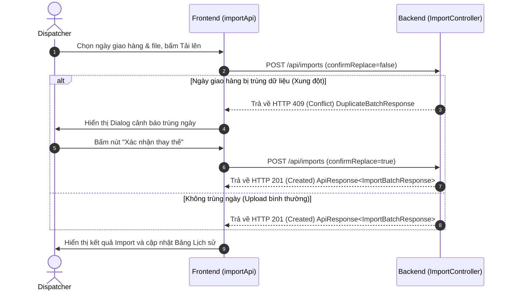

# Tài liệu Thiết kế — Tích hợp API Excel Nhập đơn hàng

Tài liệu này trình bày thiết kế và kế hoạch tích hợp giao diện frontend React + TypeScript với các API thực tế của Spring Boot backend cho module **Excel Nhập đơn hàng**.

---

## 1. Tổng quan các Endpoint API

Frontend sẽ kết nối với backend tại đường dẫn `/api/imports` thông qua các endpoint sau (được ánh xạ từ `ImportController.java`):

| Endpoint | Phương thức | Quyền | Tham số | Định dạng dữ liệu trả về (Response Payload) | Mô tả |
|---|---|---|---|---|---|
| `/api/imports` | `POST` | `DISPATCHER` | `MultipartFile file`, `LocalDate deliveryDate`, `boolean confirmReplace` | `ApiResponse<ImportBatchResponse>` | Tải file Excel đơn hàng lên. Trả về `DuplicateBatchResponse` khi trùng ngày giao hàng (HTTP 409). |
| `/api/imports` | `GET` | `DISPATCHER`, `LOGISTICS_MANAGER`, `SYSTEM_ADMIN` | `LocalDate deliveryDate` (tùy chọn), `Pageable` | `ApiResponse<List<ImportBatchResponse>>` | Lấy danh sách lịch sử nhập đơn hàng (phân trang). |
| `/api/imports/{id}` | `GET` | `DISPATCHER`, `LOGISTICS_MANAGER`, `SYSTEM_ADMIN` | `Long batchId` (đường dẫn) | `ApiResponse<ImportBatchResponse>` | Lấy thông tin chi tiết của một batch import bằng ID. |
| `/api/imports/{id}/errors` | `GET` | `DISPATCHER`, `LOGISTICS_MANAGER` | `Long batchId` (đường dẫn) | `ApiResponse<List<ImportErrorResponse>>` | Lấy danh sách chi tiết các dòng bị lỗi của một batch. |

---

## 2. Kiểu dữ liệu & Hàm ánh xạ (Mapper Utility)

Backend sử dụng một số tên trường (field name) hơi khác so với dữ liệu mà các component frontend hiện tại đang sử dụng. Chúng ta sẽ xây dựng một file mapper tại `src/utils/importMapper.ts` để ánh xạ chính xác dữ liệu từ backend về frontend.

### Bảng đối chiếu các trường:

#### Thông tin Batch:
- `batchId` (Backend) ➜ `id` (Frontend)
- `ordersCreated` (Backend) ➜ `createdOrders` (Frontend)
- `createdAt` (Backend) ➜ `uploadedAt` (Frontend)

#### Thông tin Dòng lỗi:
- `rawData` (Backend) ➜ `originalContent` (Frontend)

### Code đề xuất cho Mapper (`src/utils/importMapper.ts`):
```typescript
import type { ImportBatchHistory, ImportResult, ImportErrorRow } from '../types/import';

export const mapBatchResponseToHistory = (raw: any): ImportBatchHistory => {
  return {
    id: raw.batchId,
    deliveryDate: raw.deliveryDate,
    fileName: raw.fileName,
    uploadedBy: 'N/A', // Backend không trả về username, mặc định hiển thị N/A
    totalRows: raw.totalRows ?? 0,
    acceptedRows: raw.acceptedRows ?? 0,
    rejectedRows: raw.rejectedRows ?? 0,
    createdOrders: Number(raw.ordersCreated ?? 0),
    isActive: raw.isActive ?? false,
    uploadedAt: raw.createdAt,
  };
};

export const mapBatchResponseToResult = (raw: any, errors: ImportErrorRow[] = []): ImportResult => {
  return {
    batchId: raw.batchId,
    deliveryDate: raw.deliveryDate,
    fileName: raw.fileName,
    totalRows: raw.totalRows ?? 0,
    acceptedRows: raw.acceptedRows ?? 0,
    rejectedRows: raw.rejectedRows ?? 0,
    createdOrders: Number(raw.ordersCreated ?? 0),
    errors: errors,
  };
};

export const mapErrorResponseToRow = (raw: any): ImportErrorRow => {
  return {
    rowNumber: raw.rowNumber,
    originalContent: raw.rawData,
    errorReason: raw.errorReason,
  };
};
```

---

## 3. Kiến trúc dịch vụ tích hợp (Integration Service)

Chúng ta sẽ tạo file `src/api/importApi.ts` sử dụng `axiosInstance` hiện có của dự án. File này sẽ kiểm tra cấu hình `USE_MOCK_API` từ `src/config.ts`.
- Nếu `USE_MOCK_API = true`, nó sẽ gọi mock service như cũ.
- Nếu `USE_MOCK_API = false`, nó sẽ gọi API backend thật. Cách này giúp hệ thống linh hoạt, dễ dàng chuyển đổi qua lại.

### Sơ đồ luồng Upload xử lý lỗi trùng ngày (Conflict HTTP 409):



---

## 4. Điều chỉnh các Trang Giao diện (UI)

1. **`OrderImportPage.tsx`**:
   - Thay thế việc import từ `src/mocks/importService` sang dùng `src/api/importApi`.
   - Cập nhật hàm `executeUpload` để bắt lỗi HTTP status `409` từ backend. Khi gặp lỗi 409, lưu thông tin form vào `pendingUpload` và mở `ReplaceBatchModal`.
   - Thay thế việc phân trang tự chế bằng cách truyền tham số `page` và `size` thật cho API backend và lấy tổng số bản ghi từ phần `pagination` của response backend.

2. **`ImportBatchDetailPage.tsx`**:
   - Thay thế mock bằng cách gọi đồng thời hai API: `importApi.getBatchDetail(batchId)` để lấy thông tin batch và `importApi.getBatchErrors(batchId)` để lấy danh sách lỗi của batch đó nếu số dòng lỗi `rejectedRows > 0`.
